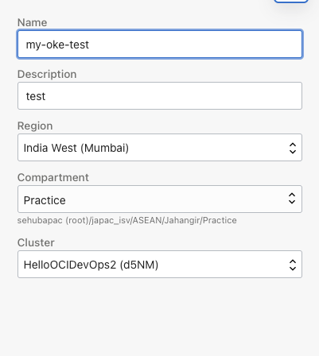

# Using Oracle Cloud Infrastructure DevOps Services (CI/CD)


##### In this project we shall use a simple vannila calculator app to build and deploy on OKE using Oracle DevOps services (CI/CD)


### **Objective:**

- Build a CI/CD pipeline using OCI DevOps services
- Deploy Calculator App in OKE
- Change Code to trigger the build and deployment


## Steps

### A. Pre-requisite/Info Collection

```
## Info Collection
Auth Token: <auth_token>  # eg: Za46wPS)EmfiZ]gFI::qK
Tenancy Name: <tenancy_name>	# eg: mytenancy
Tenancy Namespace: <tenancy_namespace>	# eg: idxkmma2unaf
OCI username: <oci_user_name>	# eg: oracleidentitycloudservice/user01_idcs

OCIR Region: <ocir_region>
OCIR Repo Name: <ocir_repo_name>	# create if needed
OCIR Repo Full Name: <ocir_region>/<ocir_repo_name>

git username: <tenancy_name>/<oci_user_name>
git password: <auth_token>

docker login username (OCIR): <tenancy_namespace>/<username> 
docker login password (OCIR): <auth_token>

```

### B. Deploy OKE Cluster in OCI

```
a. Deploy OKE Cluster1 for Test/DEV/UAT environment
b. Deploy OKE Cluster2 for Prod environment
```

### C. Create DevOps Project

```
a. Create a Topic/Notification
b. Create DevOps Project
c. Enable Logging for the DevOps 
d. Create an Empty Code Repository -> Clone -> Copy http URL
```

### D. Clone Repo in Dev Machine

```
## Developer Machine; Make sure you have git and docker installed

## Clone OCI code repo to local dev machine # ref 3.d
$ git clone <oci_code_repo_url>	# if prompted provide "git username", "git password"

## Clone the calculator repo from github & copy contents  into above
$ git clone https://github.com/jahangir2526/oci-devops.git

## Copy contents into OCI Repo
$ cp -r oci-devops/ci-cd-calc-oke/* <oci-repo-location>

## Copy contents in to OCI code repo, push changes
$ git add -A
$ git config credential.helper store	## store the credentials
$ git commit -m "initial commit"
$ git remote -v	# to see the remote
$ git push origin main

```

### E. Create OKE environment



### Create Build Pipeline


### F. Create Deployment Pipeline

**i) Add artifacts**


**b) Add Stage **


### G. Create Trigger

```
Steps Here
```


