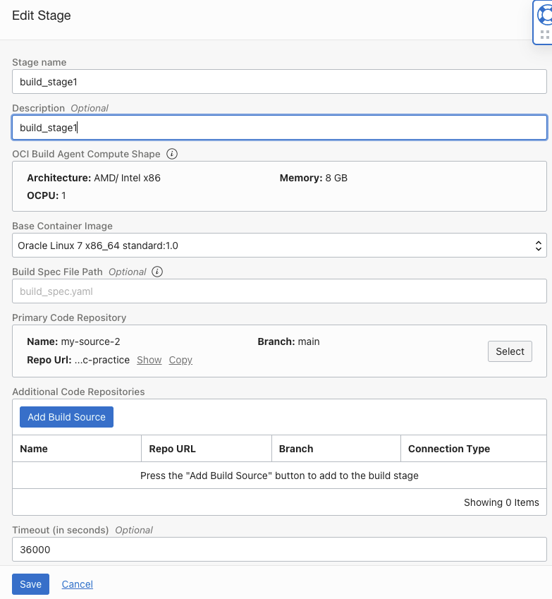
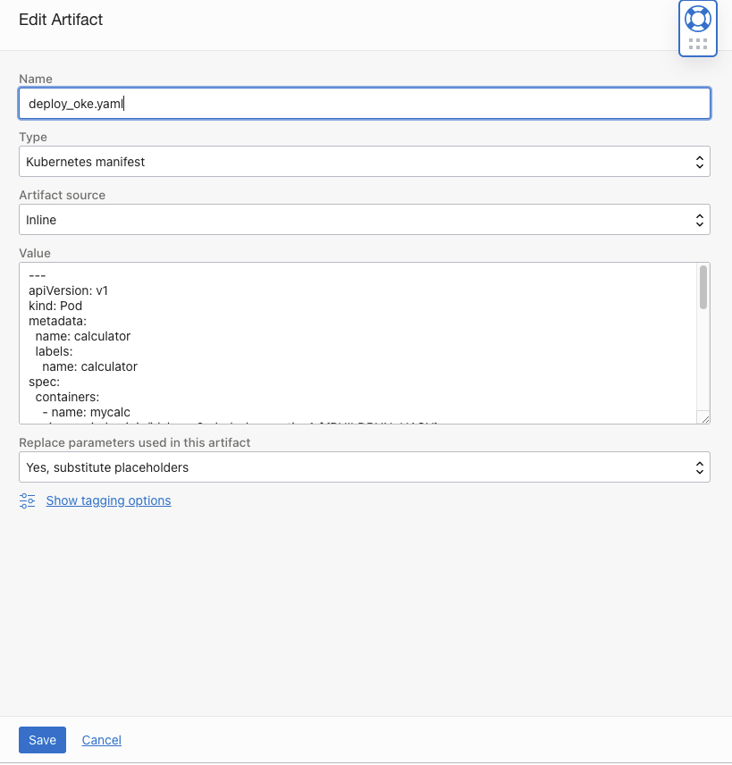
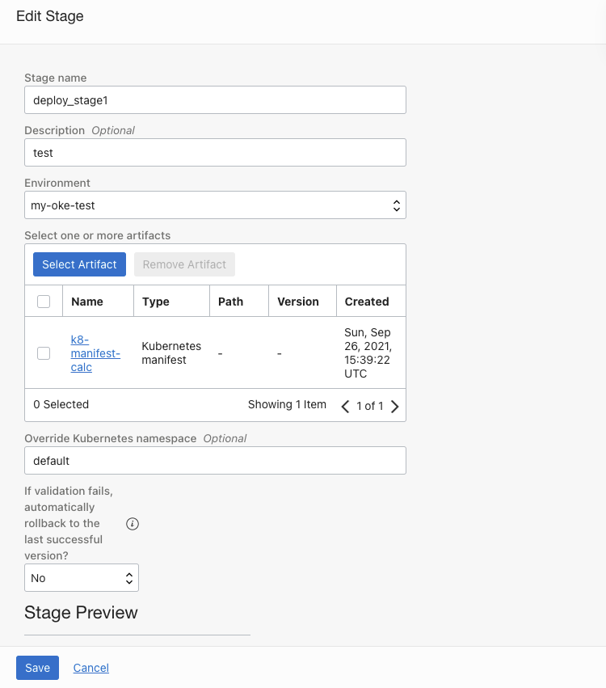

# Using Oracle Cloud Infrastructure DevOps Services (CI/CD)

**Objective:**

1. Build a CI/CD pipeline using OCI DevOps services
2. Deploy in OKE
3. Code changes and trigger the CI/CD

##### In this project we shall use a simple vannila calculator app to build and deploy on OKE using Oracle DevOps services (CI/CD)

## Steps

### 1. Pre-requisite/Info Collection

```
## Collect
Auth Token: <auth_token>  # eg: Za46wPS)EmfiZ]gFI::qK
Tenancy Name: <tenancy_name>	# eg: mytenancy
Tenancy Namespace: <tenancy_namespace>	# eg: idxkmma2unaf
OCI username: <oci_user_name>	# eg: oracleidentitycloudservice/user01_idcs

OCIR Region: <ocir_region>
OCIR Repo Name: <ocir_repo_name>	# create if needed
OCIR Repo Full Name: <ocir_region>/<ocir_repo_name>

git username: <tenancy_name>/<oci_user_name>
git password: <auth_token>

docker login username (OCIR): <tenancy_namespace>/<username> 
docker login password (OCIR): <auth_token>

```

### 2. Deploy OKE Cluster in OCI

```
a. Deploy OKE Cluster1 for Test/DEV/UAT environment
b. Deploy OKE Cluster2 for Prod environment
```

### 3. Create DevOps Project

```
a. Create a Topic/Notification
b. Create DevOps Project
c. Enable Logging for the DevOps 
d. Create an Empty Code Repository -> Clone -> Copy http URL
```

### 2. Clone in Dev Machine

```
## Developer Machine; Make sure you have git and docker installed

## Clone OCI code repo to local dev machine # ref 3.d
$ git clone <oci_code_repo_url>	# if prompted provide "git username", "git password"

## Clone the calculator repo from github & copy contents  into above
$ git clone https://github.com/jahangir2526/Vanilla-JavaScript-Calculator.git

## Copy contents in to OCI code repo, push changes
$ git add -A
$ git config credential.helper store	## store the credentials
$ git commit -m "initial commit"
$ git remote -v	# to see the remote
$ git push origin main

```

### Create Build Pipeline



### 4. Deployment Pipeline (Add Artifacts)

**a) add artifacts**




**b) Create deployment pipeline **



### 5. Create Trigger

```
Steps Here
```


## **1. Deploy OKE Cluster**

OCI provides one-click cluster deployment and will take care of creation of VCN, subnets, security list, Kubernetes Master and Worker Nodes.

## **2. Set up OCI DevOps CICD Pipeline**

### a. Create Project
```
Steps Here
```
### b. Create Code Repository
```
Steps Here
```
### c. Create Artifacts
```
Steps Here
```
### d. Create Environment
```
Steps Here
```
### e. Create Deployment Pipeline
```
Steps Here
```
### f. Create Build Pipeline
```
Steps Here
```
### g. Create Trigger
```
Steps Here
```

## **3. Trigger CICD Pipeline** 
```
Steps Here
```

